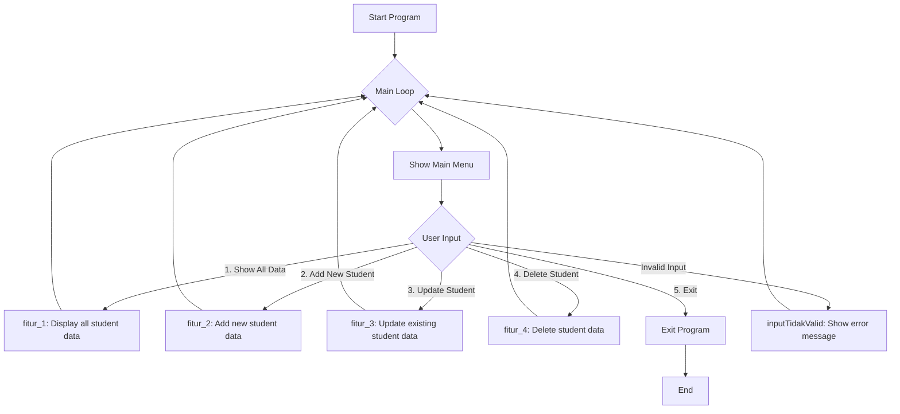

# Capstone Project 1: Student Scores Data

# OVERVIEW
This program is a simple student data management system built with Python. It helps users to manage student information, including personal data and subject grades. The system supports basic CRUD (Create, Read, Update, Delete) operations and uses a Python dictionary to store and manage data. Through a console-based menu, users can easily add new students, view data, update existing records, and remove data by using student NIP (ID).

# FEATURES
Create
  - Add a new student with personal info and subject scores

Read
  - Show all student records
  - View data by student NIP (ID)
  - Calculate and display average scores for all students
  - Show average score of a specific student
  - List students who passed

Update
  - Modify existing student details (except the NIP)

Delete
  - Remove a student by entering their NIP

# HOW TO RUN
Save the Code: Save the Python source file as Capstone Project 1.py

Open Terminal or Command Prompt: Navigate to the folder where the file is saved.

Run the Program: Execute the program using the command:

# USAGE
When the program starts, a menu will appear. Choose an option by typing the corresponding number:

## menu utama:
    1. Melihat Data Mahasiswa
    2. Menambah Data Mahasiswa
    3. Mengubah Data Mahasiswa
    4. Menghapus Data Mahasiswa
    5. Exit
    
Each option leads to relevant submenus for more specific tasks.

# STRUCTURE OF THE APPLICATION
  - menu_utama()
    Acts as the main menu controller. It continuously displays the main options to the user and routes to the appropriate function (fitur_1() to fitur_4()) based on the user’s selection.

  - input_menu()
    Collects and returns the user's menu choice. It helps in separating user input logic from the menu processing logic.

  - inputTidakValid()
    Displays an error message when the user inputs an invalid menu option. It helps maintain user guidance and a smooth flow by redirecting them back to the main menu.

  - fitur_1()
    Displays all student data stored in the system. It prints each student's name, scores in different subjects, and calculates their average score.

  - fitur_2()
    Allows the user to add new student data. It prompts the user to input the student’s name and grades, then stores them in the central dictionary data_siswa.

  - fitur_3()
    Enables updating of existing student records. Users can choose which student to update and modify their scores for each subject.

  - fitur_4()
    Provides the functionality to delete student data from the system. Users can select a student by name to permanently remove their record.

# POTENTIAL FUTURE ENHANCEMENTS
  - Add the ability to save and load student data from a file (e.g., CSV or JSON).
  - Add login authentication for teachers or admins.
  - Implement a GUI using Tkinter or PyQt for better usability.

# FLOWCHART

# AUTHOR
Aufaa Zuhair 
